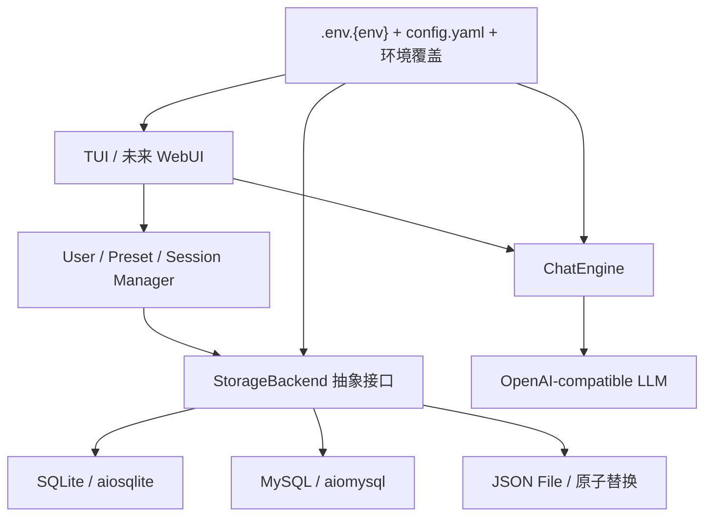

# 系统架构

## 设计目标

项目采用异步、分层、可插拔设计。业务层只依赖 `StorageBackend`，TUI 只调用业务管理器，
因此 SQLite、MySQL、File 后端切换不会改变用户、预设、会话和搜索逻辑。

## 目录职责

| 目录 | 职责 |
|---|---|
| `src/models` | Pydantic 数据实体与校验 |
| `src/storage` | 存储契约、工厂和三种后端 |
| `src/core` | 配置、日志及领域业务规则 |
| `src/interface` | UI 契约与未来能力扩展点 |
| `src/ui/tui` | Rich/prompt_toolkit 终端交互 |
| `scripts` | 数据库初始化等运维入口 |
| `tests` | 离线单元与集成测试 |

## 关键数据流

一次对话的顺序为：TUI 接收输入 → SessionManager 保存 human 消息 → 加载历史并附加预设
SystemMessage → ChatEngine 流式调用模型 → TUI 逐段渲染 → SessionManager 保存 ai 消息并累计
Token。所有持久化均通过抽象接口完成。

## 数据与安全边界

- `.env` 和各环境 `.env.*` 保存密钥，绝不提交。
- 所有会话、搜索、预设修改和导出均校验当前用户归属。
- SQLite 使用外键级联；MySQL 使用 InnoDB 外键；File 后端在事务锁内手动级联并原子替换。
- 日志不记录 API Key 和数据库密码。

## 多环境配置

`AppConfig` 先加载共享 `config.yaml`，再以 `config.dev.yaml`、`config.test.yaml` 或
`config.prod.yaml` 深度覆盖。`APP_ENV` 默认是 dev，只接受 dev/test/prod。密钥从同名
`.env.{env}` 加载；仅 dev 为兼容旧项目，在 `.env.dev` 不存在时允许读取 `.env`。

| 环境 | 默认存储 | 数据源 |
|---|---|---|
| dev | SQLite | `data/dev/sqlite/app.db` |
| test | SQLite | `data/test/sqlite/app.db` |
| prod | MySQL | `storage.mysql` + `.env.prod` 密码 |

## 扩展点

`AbstractUI` 已提供 capability 查询、多模型并行、附件、语音、Tool Calling 确认方法。
未来 WebUI 实现同一接口；新存储后端实现 `StorageBackend` 后注册到 `StorageFactory` 即可。

## 运行与验证入口

| 入口 | 用途 |
|---|---|
| `uv run python src/main.py` | 启动当前环境的主线 TUI |
| `uv run python scripts/init_db.py` | 初始化当前环境的存储后端 |
| `APP_ENV=test uv run pytest` | 运行离线测试套件 |
| `uv run streamlit run app.py` | 启动保留的早期 Streamlit 应用 |

MySQL 真实连通性属于部署环境验收项；本地交付仅验证了后端契约、建表 SQL 和工厂构造。
